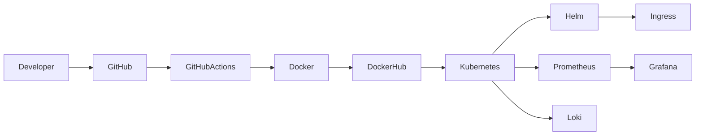

<div align="center">

# 🚀 Hi, I'm Rakshith


<p>


</p>

### ☁️ Building Cloud-Native Infrastructure • Automating Everything • Solving Production Problems

</div>

---

# 💫 About Me

```yaml
Name: Rakshith

Role: DevOps & Cloud Engineer

Focus:
  - Kubernetes
  - Docker
  - Linux
  - Cloud Native
  - Monitoring
  - Observability
  - CI/CD
  - Infrastructure Automation

Currently Learning:
  - Production Kubernetes
  - Linux Administration
  - Helm
  - Prometheus
  - Grafana
  - Loki

Motto:
  Build → Automate → Monitor → Troubleshoot → Improve
```

---

# ⚡ Tech Stack

## ☁️ Cloud & DevOps

<p align="center">


</p>

---

## 📊 Monitoring Stack

<p align="center">


</p>

---

## 🛠 Tools

<p align="center">


</p>

---

# 🚀 Featured Projects

## ☁️ Cloud Native Platform

> Production-style Kubernetes deployment platform.

### Technologies

- Git
- GitHub
- Docker
- Docker Hub
- Kubernetes
- Helm
- GitHub Actions
- Linux
- Ingress

### Highlights

- ✅ Containerized Applications
- ✅ Kubernetes Deployments
- ✅ Helm Charts
- ✅ GitHub Actions CI/CD
- ✅ Ingress Routing
- ✅ Docker Image Management

---

## 📊 Kubernetes Observability Platform

Production-ready monitoring stack built on Kubernetes.

### Technologies

- Kubernetes
- Docker
- Helm
- Prometheus
- Grafana
- Loki
- GitHub Actions
- Linux

### Features

- 📈 Metrics Collection
- 📊 Dashboards
- 📢 Alerting
- 📂 Centralized Logging
- ⚡ Infrastructure Monitoring
- 🔍 PromQL Practice

---

# 🏗 DevOps Workflow



---

# 📚 Current Learning

- 🌱 Linux Administration
- ☸ Kubernetes Administration
- ☁️ Cloud Native Infrastructure
- 📊 Monitoring
- 📈 Observability
- ⚙️ Production Troubleshooting
- 🚀 DevOps Best Practices

---

# 📈 GitHub Analytics

<div align="center">


</div>

---

<div align="center">


</div>

---

<div align="center">


</div>

---

# 🏆 GitHub Trophies

<div align="center">


</div>

---

# 🚀 DevOps Roadmap

```text
Git               ████████████████████

GitHub            ████████████████████

Linux             ████████████████░░░░

Docker            ████████████████████

Kubernetes        ███████████████░░░░░

Helm              █████████████░░░░░░░

GitHub Actions    ███████████████░░░░░

Prometheus        ██████████████░░░░░░

Grafana           ██████████████░░░░░░

Loki              ████████████░░░░░░░░
```

---

# 🎯 Goals

- ☁️ Become a Production DevOps Engineer
- ☸ Master Kubernetes
- 📊 Build Enterprise Monitoring Platforms
- ⚙️ Automate Everything
- 🚀 Learn Large Scale Infrastructure
- 🌍 Contribute to Open Source

---

# 💡 DevOps Philosophy

> **Build. Automate. Monitor. Troubleshoot. Improve.**

---

# 🌐 Connect With Me

<p align="center">

<a href="https://github.com/RAKSHITH256">

</a>

<a href="https://linkedin.com/in/YOUR_LINKEDIN">

</a>

<a href="mailto:rakshithcshetty55@gmail.com">

</a>

</p>

---

<div align="center">

### ⭐ Thanks for visiting my profile!


</div>
