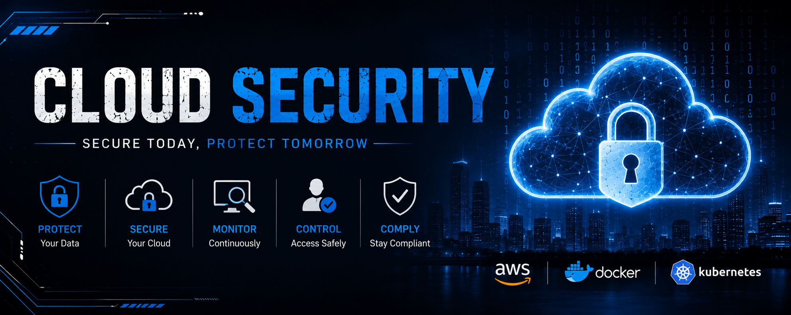

# 🚀 Hi, I'm Rakshith

☁️ DevOps & Cloud Enthusiast
⚙️ Passionate about Kubernetes, Cloud-Native Infrastructure, Monitoring, Observability, and Automation.

---

# 👨‍💻 About Me

I am a hands-on DevOps learner focused on building practical cloud-native infrastructure and observability solutions using modern DevOps tools and Kubernetes ecosystems.

I enjoy working on:

* Kubernetes deployments
* Monitoring & observability
* Infrastructure automation
* CI/CD workflows
* Cloud-native tooling
* Production-style DevOps environments

My learning approach focuses heavily on:

# building → troubleshooting → monitoring → improving

through real-world projects and operational practice.

---

# 🧰 DevOps & Cloud Stack

---

# ☸️ Current Learning Focus

* Kubernetes Administration
* Cloud-Native Infrastructure
* Monitoring & Observability
* Production Monitoring Systems
* Prometheus & Grafana
* Kubernetes Networking
* Helm & Package Management
* CI/CD Automation
* Linux Administration
* Infrastructure Troubleshooting

---

# 🚀 Featured Projects

---

# 📊 Production-Ready Kubernetes Observability Platform

Designed and implemented a complete cloud-native monitoring and observability platform using Kubernetes and modern DevOps tooling.

## 🔧 Technologies Used

* Kubernetes
* Docker
* Helm
* Prometheus
* Grafana
* Loki
* GitHub Actions
* Ingress
* Linux

## 📌 Features

* Kubernetes cluster monitoring
* Grafana dashboards & visualizations
* Dynamic dashboard variables
* Chained Grafana variables
* Prometheus alerting system
* Infrastructure monitoring
* Node metrics collection
* Centralized logging architecture
* CI/CD workflow concepts
* Helm-based deployments
* Ingress-based traffic routing

## 📈 Key Learnings

* Kubernetes observability
* PromQL querying
* Monitoring architecture
* SRE concepts
* Incident monitoring
* Alert management
* Cloud-native troubleshooting
* Production-style deployments

---

# ⚡ Kubernetes Web Application Deployment

Built and deployed containerized applications on Kubernetes with service exposure and ingress routing.

## 🔧 Features

* Dockerized applications
* Kubernetes deployments
* Service discovery
* Ingress configuration
* Namespace management
* Kubernetes networking basics

---

# 🔄 CI/CD Automation Workflow

Implemented GitHub Actions workflows for DevOps automation concepts.

## 🔧 Features

* Automated workflows
* Docker image build concepts
* GitHub integration
* CI/CD pipeline basics
* Deployment automation workflows

---

# 📈 Skills

### ☁️ Cloud & DevOps

Kubernetes • Docker • Helm • GitHub Actions • CI/CD • Linux • Ingress • Cloud-Native Infrastructure

### 📊 Monitoring & Observability

Prometheus • Grafana • Loki • Monitoring • Alerting • Dashboards • PromQL • Observability

### ⚙️ Infrastructure & Operations

Infrastructure Monitoring • Kubernetes Networking • Troubleshooting • System Monitoring • DevOps Workflows

---

# 📚 Currently Practicing

* Kubernetes Troubleshooting
* DevOps Job Simulations
* Monitoring Stack Deployments
* Infrastructure Debugging
* Linux Administration
* Real-World DevOps Labs
* Cloud-Native Workflows

---

# 🎯 Goals

To become a skilled DevOps & Cloud Engineer by building strong practical expertise in:

* Kubernetes
* Cloud-Native Infrastructure
* Monitoring & Observability
* Automation & CI/CD
* Scalable Distributed Systems
* Production Operations

---

# 🌟 Motto

"Build. Monitor. Troubleshoot. Improve."

---
