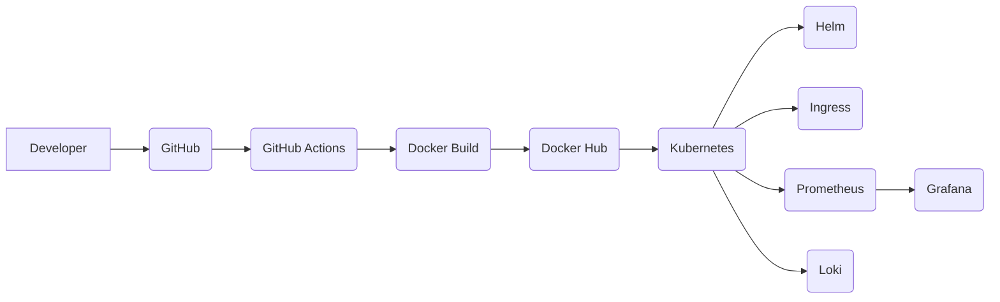

<div align="center">


[](https://git.io/typing-svg)

<p>

<a href="https://github.com/RAkSHITH256">

</a>

<a href="https://www.linkedin.com/in/rakshith-c-4b7002342/">

</a>

<a href="mailto:rakshithcshetty55@gmail.com">

</a>

</p>


</div>

---

# 💫 About Me


```yaml
Name: Rakshith C

Role: DevOps & Cloud Engineer

Location: India

Current Focus:
  - Kubernetes
  - Docker
  - Linux
  - GitHub Actions
  - Helm
  - Prometheus
  - Grafana
  - Loki

Learning Philosophy:
  Build
       ↓
  Automate
       ↓
  Monitor
       ↓
 Troubleshoot
       ↓
   Improve
```

- ☁️ Passionate about **Cloud Native Infrastructure**
- ☸️ Building **Production-style Kubernetes Projects**
- 📊 Love **Monitoring & Observability**
- ⚙️ Enjoy automating repetitive work
- 🚀 Continuously improving through hands-on labs

<br clear="right"/>

---

# ⚡ Tech Arsenal

<div align="center">

## ☁️ Cloud & Containers


## ⚙️ DevOps


<br>


</div>

---

# 🚀 Featured Projects

<table>
<tr>

<td width="50%">

## ☁️ Cloud Native Platform

Production-ready Kubernetes deployment platform.

### Stack

- Docker
- Kubernetes
- Helm
- GitHub Actions
- Linux
- Ingress

### Features

✅ Containerized Applications

✅ Kubernetes Deployments

✅ Helm Charts

✅ CI/CD Pipeline

✅ Ingress Routing

</td>

<td width="50%">

## 📊 Observability Platform

Production Monitoring Stack.

### Stack

- Prometheus
- Grafana
- Loki
- Kubernetes
- Helm

### Features

📈 Metrics Collection

📊 Dashboards

📢 Alerting

📂 Centralized Logging

⚡ Infrastructure Monitoring

</td>

</tr>
</table>

---

# 🏗 Cloud Native Workflow



---

# 📈 GitHub Analytics

<div align="center">


</div>

---

<div align="center">


</div>

---

<div align="center">


</div>

---

<div align="center">


</div>

---

# 🧠 Currently Learning

```text
████████████████████████████████████

☸ Kubernetes Administration

⚙ Linux Administration

📊 Prometheus & Grafana

📂 Loki Logging

🚀 GitHub Actions

☁ Cloud Native Architecture

🛠 Infrastructure Troubleshooting

████████████████████████████████████
```

---

# 🎯 2026 Goals

| Goal | Status |
|------|--------|
| ☸ Master Kubernetes | 🚧 |
| 📊 Enterprise Monitoring | 🚧 |
| 🚀 Production DevOps | 🚧 |
| ☁ Cloud Native | 🚧 |
| 🌍 Open Source Contributions | 🚧 |
| ⚙ Infrastructure Automation | 🚧 |

---

# 💡 DevOps Philosophy

> ### **Build → Automate → Monitor → Troubleshoot → Improve**

---

<div align="center">

## 🌐 Let's Connect

<a href="https://github.com/RAkSHITH256">

</a>

<a href="https://www.linkedin.com/in/rakshith-c-4b7002342/">

</a>

<a href="mailto:rakshithcshetty55@gmail.com">

</a>

<br><br>


</div>
